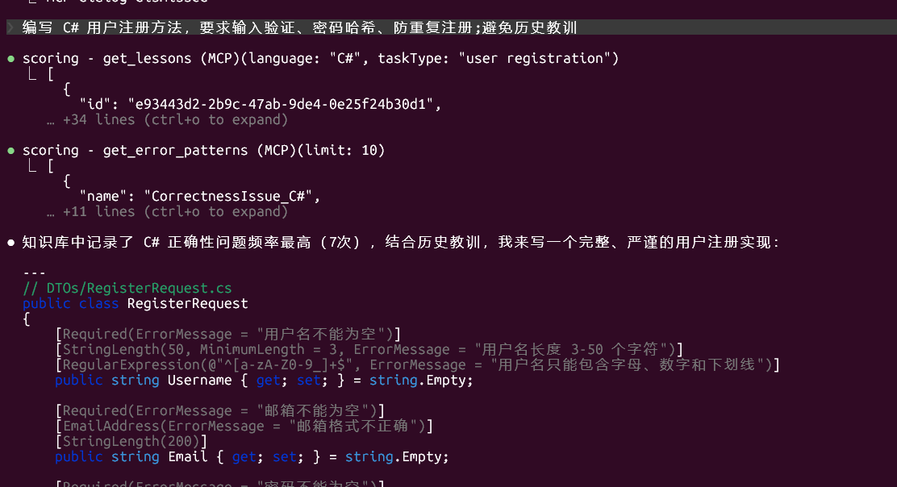
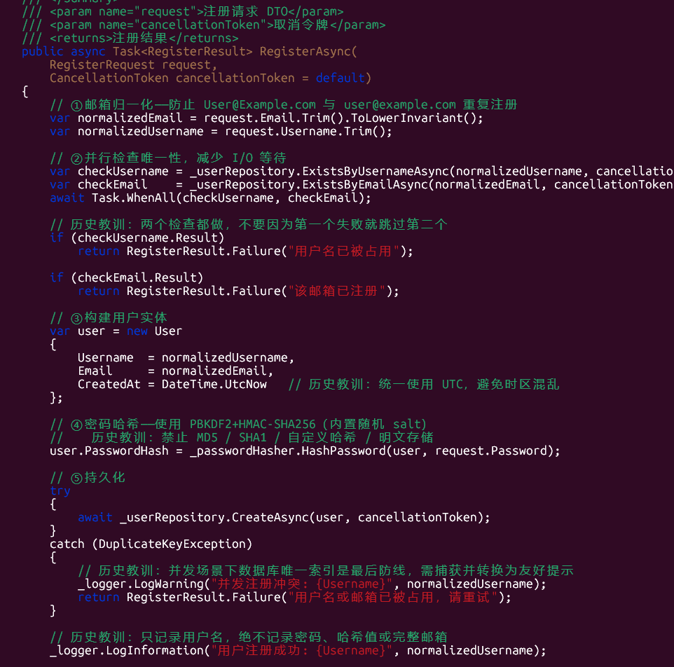
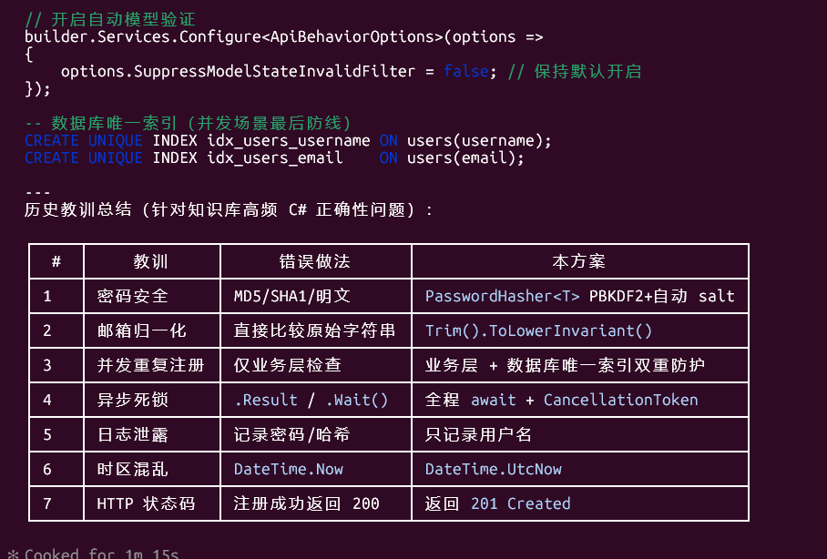
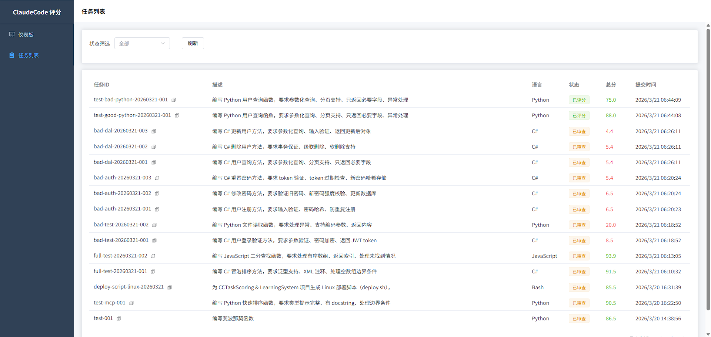

# 🤖 CCTaskScoring & LearningSystem

ClaudeCode 任务评分与学习系统。将评分能力封装为 **MCP 服务器**，ClaudeCode 通过标准 MCP 协议提交任务、查询评分、获取历史教训，同时提供 Vue 3 人工审查界面。

---

## ✨ 功能概览

- 🔧 **MCP 工具**：ClaudeCode 可直接调用 `submit_task`、`get_task`、`get_lessons` 等工具
- 📊 **五维自动评分**：完成度 30% + 正确性 30% + 质量 20% + 效率 10% + UX 10%
- 🧠 **知识图谱**：Neo4j 存储错误模式与经验教训，支持按语言检索
- 🔍 **人工审查**：Vue 3 前端，支持评分修正与教训管理
- 📦 **单进程部署**：API + MCP Server + 前端静态文件统一由 ASP.NET Core 托管，单端口对外

---

## 🛠️ 技术栈

| 层次 | 技术 |
|------|------|
| 后端 | C# 12 / .NET 8 / ASP.NET Core 8 |
| MCP | ModelContextProtocol.AspNetCore 1.1.0 |
| 主数据库 | SQLite（EF Core，任务/评分/奖惩） |
| 图数据库 | Neo4j 5.x（经验教训知识图谱） |
| 前端 | Vue 3 + TypeScript + Vite + Element Plus |
| 日志 | Serilog（控制台 + 滚动文件） |
| HTTP 弹性 | Polly（指数退避重试） |

---

## 📁 项目结构

```
CCTaskScoring&LearningSystem/
├── CCTaskScoring.Api/          # Web 层：控制器、MCP 工具、后台服务
│   ├── Controllers/            # REST API 控制器
│   ├── Mcp/                    # MCP 工具定义（ScoringMcpTools）
│   ├── Services/               # ScoringBackgroundService（后台评分队列）
│   └── wwwroot/                # Vue 3 构建产物（由 ASP.NET Core 托管）
├── CCTaskScoring.Core/         # 领域层：模型、接口、DTO
├── CCTaskScoring.Infrastructure/ # 基础设施层：EF Core、Neo4j、评分引擎
│   ├── Data/                   # AppDbContext、仓储实现
│   ├── Neo4j/                  # Neo4jService
│   ├── Scoring/                # ScoringEngine（五维评分逻辑）
│   └── Rewards/                # RewardService（奖惩机制）
├── CCTaskScoring.Tests/        # 单元测试 + 集成测试
├── frontend/                   # Vue 3 前端源码
├── neo4j/init/                 # Neo4j 初始化 Cypher 脚本
├── docker-compose.yml
├── Dockerfile
├── deploy-docker.sh            # Docker 一键部署脚本
├── deploy-native.sh            # 原生部署脚本
└── .env.example                # 环境变量模板
```

---

## 🚀 快速开始

### 🐳 方式一：Docker 部署（推荐）

**前置条件**：Docker Engine 20.10+、Docker Compose v2

```bash
# 1. 克隆项目
git clone <repo-url>
cd CCTaskScoring&LearningSystem

# 2. 复制并配置环境变量
cp .env.example .env
# 编辑 .env，填入 Neo4j 密码和 Anthropic API Key（可选）

# 3. 一键部署
bash deploy-docker.sh
```

部署完成后：

| 服务 | 地址 |
|------|------|
| 🌐 前端 / API | http://localhost:8080 |
| 🔌 MCP 端点 | http://localhost:8080/mcp |
| 📖 Swagger UI | http://localhost:8080/swagger |
| 🗄️ Neo4j Browser | http://localhost:7474 |

更新服务：
```bash
bash deploy-docker.sh --update
```

停止服务：
```bash
bash deploy-docker.sh --down
```

---

### 💻 方式二：本地部署

**前置条件**：.NET 8 SDK、Node.js 20+、Neo4j（可选）

```bash
# 1. 启动后端
cd CCTaskScoring.Api
dotnet run

# 2. 启动前端开发服务器（另开终端）
cd frontend
npm install
npm run dev
```

后端默认监听 `http://localhost:5176`，前端开发服务器代理 API 请求。

---

## ⚙️ 环境变量

复制 `.env.example` 为 `.env` 并按需修改：

```env
# ASP.NET Core
ASPNETCORE_ENVIRONMENT=Production
ASPNETCORE_URLS=http://+:8080

# SQLite 数据库路径
ConnectionStrings__Default=Data Source=data/scoring.db

# Neo4j（可选，不配置时教训功能降级为空列表）
NEO4J_URI=bolt://neo4j:7687
NEO4J_USER=neo4j
NEO4J_PASSWORD=your_password

# Anthropic API（可选，AI 辅助评分功能需要）
MCP_API_KEY=sk-ant-your-api-key-here
MCP_ENDPOINT=https://api.anthropic.com
```

> 🔒 **安全提示**：`.env` 已加入 `.gitignore`，请勿将含真实密钥的文件提交到版本库。

---

## 🔌 MCP 集成

在 Claude Code 的 `.mcp.json` 中添加以下配置，即可让 ClaudeCode 发现并调用评分工具：

```json
{
  "mcpServers": {
    "scoring": {
      "type": "http",
      "url": "http://localhost:8080/mcp"
    }
  }
}
```

### 🧰 可用 MCP 工具

| 工具名 | 说明 |
|--------|------|
| `submit_task` | 📥 提交任务进行自动评分（异步处理） |
| `get_task` | 🔎 查询任务详情和评分结果 |
| `list_tasks` | 📋 分页列出任务，支持状态过滤 |
| `review_task` | ✏️ 人工修正五维评分 |
| `get_analytics_summary` | 📈 获取系统统计摘要（总数、平均分等） |
| `get_error_patterns` | ⚠️ 获取高频错误模式（来自 Neo4j） |
| `get_lessons` | 💡 获取历史经验教训（按语言过滤） |

**示例：提交任务**

```
submit_task(
  taskId="uuid-xxx",
  description="编写快速排序函数",
  language="Python",
  code="def quicksort(arr): ...",
  passed=5,
  failed=0,
  lintScore=9.0,
  durationSec=120
)
```

---

## 📡 REST API

所有接口以 `/api/v1` 为前缀，开发环境可通过 Swagger UI（`/swagger`）查看完整文档。

| 方法 | 路径 | 说明 |
|------|------|------|
| `POST` | `/api/v1/tasks` | 📥 提交任务 |
| `GET` | `/api/v1/tasks` | 📋 获取任务列表（分页） |
| `GET` | `/api/v1/tasks/{id}` | 🔎 获取任务详情 |
| `PUT` | `/api/v1/tasks/{id}/review` | ✏️ 人工审查修正评分 |
| `GET` | `/api/v1/tasks/{id}/lessons` | 💡 获取任务关联教训 |
| `POST` | `/api/v1/tasks/{id}/lessons` | ➕ 为任务创建教训 |
| `GET` | `/api/v1/analytics/summary` | 📈 统计摘要 |
| `GET` | `/health` | 💚 健康检查 |

---

## 📊 评分规则

任务评分分为五个维度，加权计算总分：

| 维度 | 权重 | 说明 |
|------|------|------|
| ✅ 完成度 | 30% | 任务需求是否全部实现 |
| 🎯 正确性 | 30% | 测试通过率、逻辑正确性 |
| 🧹 代码质量 | 20% | Lint 评分、代码规范 |
| ⚡ 效率 | 10% | 执行耗时、尝试次数 |
| 🎨 用户体验 | 10% | 日志清晰度、文档完整性 |

**🏆 奖惩机制**：

| 分数区间 | 状态 | 措施 |
|----------|------|------|
| 90–100 | 🌟 优秀 | 提升任务优先级 |
| 75–89 | 👍 良好 | 无 |
| 60–74 | 🆗 合格 | 无 |
| 40–59 | ⚠️ 待改进 | 系统警告，记录在案 |
| 0–39 | ❌ 失败 | 强制人工复核，写入教训库 |

---

## 🧪 运行测试

```bash
dotnet test
```

测试项目位于 `CCTaskScoring.Tests/`，包含单元测试（评分引擎、仓储、MCP 客户端）和集成测试（API 端点）。

---

## 📝 日志

运行日志写入 `logs/app-{日期}.log`，滚动保留 30 天。Docker 部署时日志目录挂载到宿主机 `./logs`。

```bash
# Docker 实时日志
docker compose logs -f scoreservice
```
## 🎉 效果展示

<p align="center">
  
  
  
  
</p>
